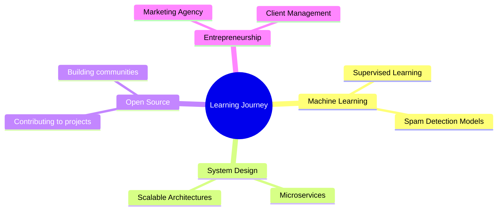

# 👨‍💻 Suryansh Singh

<div align="center">
  
  
  
  <p align="center">
    
    
  </p>
</div>

---

## 🌟 About Me


- 🎓 **B.Tech Student** at KIIT University (3rd Year)
- 💼 **Full-Stack Developer** with 2+ years experience
- 🚀 **Entrepreneur** running a marketing agency (₹10L+ revenue)
- 🌱 Currently exploring **AI/ML** and **Advanced System Design**
- 💡 Love building products that solve real problems
- 🎯 Goal: Contributing to open-source and building impactful tech

<br clear="right"/>

---

## 🛠️ Tech Arsenal

<div align="center">

### 💻 Languages & Frameworks
<p>
  
</p>

### 🗄️ Databases & Cloud
<p>
  
</p>

### 🔧 Tools & Technologies
<p>
  
</p>

</div>

---

## 📊 GitHub Analytics

<div align="center">
  
  
</div>

<div align="center">
  
</div>

---

## 🏆 Featured Projects

<div align="center">

| Project | Description | Tech Stack | Links |
|---------|-------------|------------|-------|
| 🩸 **Period Tracker** | Beautiful menstrual cycle tracker with real-time feedback | React, Node.js, MongoDB | [🔗 Demo](https://github.com/Suryansh1987/period-tracker) |
| 💬 **Instagram Extension** | Send/receive DMs from browser with sleek UI | JavaScript, Chrome APIs | [🔗 Repo](https://github.com/Suryansh1987/Instagram-messaging-extension) |
| 📄 **DocuAI** | Upload any file and ask questions - unlimited AI power | React, Python, OpenAI | [🔗 Live](https://github.com/Suryansh1987/Docu_Ai) |
| 🧠 **Gemini Clone** | AI chatbot experience inspired by Google Gemini | React, Gemini API | [🔗 Demo](https://github.com/Suryansh1987/Gemini-clone1) |

</div>

---

## 🌱 Current Focus

<div align="center">
  


</div>

---

## 📈 Activity Graph

<div align="center">
  
</div>

---

## 🎯 2024 Goals

- [ ] 🚀 Launch 3 major open-source projects
- [ ] 📚 Master advanced system design patterns
- [ ] 🤝 Contribute to 10+ open-source repositories  
- [ ] 💼 Scale marketing agency to ₹50L+ revenue
- [ ] 🎓 Complete advanced ML specialization

---

## 🏆 Achievements & Stats

<div align="center">
  
| 🎯 Metric | 📊 Value |
|-----------|----------|
| 💰 Business Revenue | ₹10L+ |
| 👥 Clients Managed | 10+ Worldwide |
| 🚀 Projects Built | 25+ |
| ⭐ GitHub Stars | 100+ |
| 🤝 Open Source Contributions | 50+ |

</div>

---

## 🎨 Fun Zone

<div align="center">

### 🎵 Coding Playlist
*"Code never lies, comments sometimes do"* 🎧

### ☕ Coffee Counter
```
☕☕☕☕☕☕☕☕☕☕ (Daily Average)
```

### 🎮 When not coding
- 🏏 Cricket enthusiast
- 📚 Reading tech blogs
- 🎵 Music production
- 🌍 Exploring new places

</div>

---

## 🤝 Let's Connect!

<div align="center">
  
[](https://portfolio-phi-sage-37.vercel.app/)
[](https://linkedin.com/in/suryanshsingh)
[](mailto:suryansh.personal@gmail.com)
[](https://twitter.com/yourhandle)
[](https://instagram.com/yourhandle)

</div>

---

<div align="center">
  
### 💭 Quote of the Day
*"Keep building, keep shipping. Consistency beats intensity."*

### 🐍 Contribution Snake


</div>

---

<div align="center">
  
</div>

<details>
<summary>📊 Detailed Stats</summary>

## 📈 Detailed GitHub Statistics

### 📅 Contribution Calendar


### 🏆 Trophy Case


### 📊 Language Usage Over Time


</details>
