# 👨‍💻 Suryansh Singh

  
  
  
  

    
    
    
  

---

## 🌟 About Me

- 🎓 **B.Tech Student** at KIIT University (3rd Year CSE)
- 💼 **Full-Stack Developer** with 2+ years experience
- 🚀 **Entrepreneur** running a marketing agency (₹10L+ revenue)
- 🔬 Currently exploring **AI/ML** and **Advanced System Design**
- 💡 Passionate about building products that solve real problems
- 🎯 Goal: Contributing to open-source and building impactful tech

 

---

## 🛠️ Tech Arsenal

### 💻 Languages & Frameworks

  

### 🗄️ Databases & Cloud

  

### 🔧 Tools & Technologies

  

---

## 📊 GitHub Analytics

  
  
  
  

  

  

---

## 🏆 Featured Projects

| 🚀 Project | 📝 Description | 🛠️ Tech Stack | 🔗 Links |
|-----------|---------------|-------------|--------|
| 🩸 **Period Tracker** | Beautiful menstrual cycle tracker with real-time feedback | React, Node.js, MongoDB | [📱 Demo](https://github.com/Suryansh1987/period-tracker) |
| 💬 **Instagram Extension** | Send/receive DMs from browser with sleek UI | JavaScript, Chrome APIs | [⚡ Extension](https://github.com/Suryansh1987/Instagram-messaging-extension) |
| 📄 **DocuAI** | Upload any file and ask questions - unlimited AI power | React, Python, OpenAI | [🤖 Live](https://github.com/Suryansh1987/Docu_Ai) |
| 🧠 **Gemini Clone** | AI chatbot experience inspired by Google Gemini | React, Gemini API | [🎯 Demo](https://github.com/Suryansh1987/Gemini-clone1) |

  

---

## 🌱 Current Learning Journey

```mermaid
mindmap
  root((🎯 Learning Journey))
    🤖 Machine Learning
      📊 Supervised Learning
      🛡️ Spam Detection Models
      🔬 Research Projects
    🏗️ System Design
      🔄 Microservices
      📈 Scalable Architectures
      ☁️ Cloud Patterns
    🌐 Open Source
      🤝 Contributing to projects
      👥 Building communities
      📚 Documentation
    💼 Entrepreneurship
      📈 Marketing Agency
      👥 Client Management
      💰 Revenue Growth
```

  

---

## 🎯 2025 Goals & Achievements

### 🏆 Current Year Goals
| Goal | Progress | Status |
|------|----------|--------|
| 🚀 Launch 3 major open-source projects | 1/3 | 🟡 In Progress |
| 📚 Master advanced system design patterns | 10% | 🟢 On Track |
| 🤝 Contribute to 10+ open-source repositories | 0/10 | 🟡 In Progress |
| 💼 Scale marketing agency to ₹50L+ revenue | 20% | 🟢 On Track |
| 🎓 Complete advanced ML specialization | 40% | 🟢 On Track |

### 📈 Achievements & Impact
| 🎯 Metric | 📊 Value | 🏆 Achievement |
|-----------|----------|---------------|
| 💰 Business Revenue | ₹10L+ | 🥇 Entrepreneur |
| 👥 Clients Managed | 10+ Worldwide | 🌍 Global Reach |
| 🚀 Projects Built | 25+ | 🛠️ Builder |

---

## 💻 Coding Activity

  
  
  

  
  
  
  
  

---

## 🏆 Trophy Collection

  

---

## 🤝 Let's Connect & Collaborate!

  
  
  
  
  
  
    
  
  
  
  

---

  

---

📊 More Detailed Analytics

 

## 📈 Comprehensive GitHub Statistics

### 📅 Yearly Contribution Overview

### 🕒 Coding Time Distribution

### 🎯 Repository Stats

### 📊 Language Evolution

---

  

